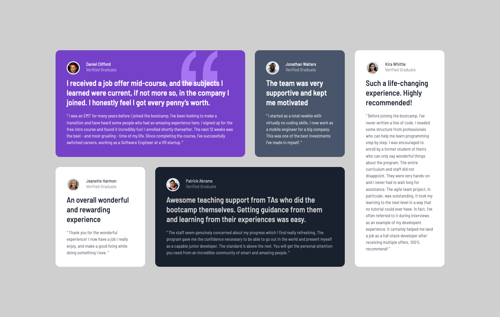

# Frontend Mentor - Testimonials grid section solution

This is a solution to the [Testimonials grid section challenge on Frontend Mentor](https://www.frontendmentor.io/challenges/testimonials-grid-section-Nnw6J7Un7). Frontend Mentor challenges help you improve your coding skills by building realistic projects.

## Table of contents

- [Overview](#overview)
  - [The challenge](#the-challenge)
  - [Screenshot](#screenshot)
  - [Links](#links)
- [My process](#my-process)
  - [Built with](#built-with)
  - [What I learned](#what-i-learned)
  - [Continued development](#continued-development)
  - [Useful resources](#useful-resources)
- [Author](#author)
- [Acknowledgments](#acknowledgments)

**Note: Delete this note and update the table of contents based on what sections you keep.**

## Overview

### The challenge

Users should be able to:

- View the optimal layout for the site depending on their device's screen size

### Screenshot

### Links

- Solution URL: [Add solution URL here](https://your-solution-url.com)
- Live Site URL: [Add live site URL here](https://your-live-site-url.com)

## My process

### Built with

- Semantic HTML5 markup
- CSS custom properties
- Flexbox
- CSS Grid
- Mobile-first workflow

### Useful resources

- [CSS Tricks](https://css-tricks.com/snippets/css/complete-guide-grid/#prop-grid-template-columns-rows) - Helped me understand how to use Grids and specifically how to use grid-area which was very helpful in figuring out how to place the testimonial cards in the desktop view.
- [Josh W Comeau](https://www.joshwcomeau.com/css/interactive-guide-to-grid/) - This was another site that helped me understand how grids worked. I found the interactive examples and snippets of code provided very insightful.

## Author

- Frontend Mentor - [Link](https://www.frontendmentor.io/profile/teuthix)
